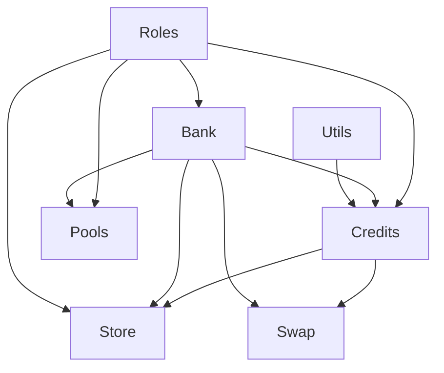

# Efforce smart contracts

# Introduction

This is the repository contains the smart contracts for the Efforce platform:

- **Bank**: Responsible for receiving tokens and withdrawals.
- **Credits**: Implements the ERC1155 standard for the carbon credits. Credits are assigned to vintages and this projects.
- **Pools**: Allows to open, manage and invest into pools.
- **Roles**: Assign accounts the admin or contract owner role.
- **Store**: Manages the primary market for the carbon credits.
- **Swap**: Manages the secondary market for the carbon credits and thus the orders book.

## Scripts

`npm install` installs the required packages.

`npm run deploy` deploys all the smart contracts to the polygon main network. 

`npm run deploy-testnet` deploys the smart contracts to the mumbai test network. 

`npm run test` run tests on the smart contracts with local hardhat network.

To run the `deploy` scripts, the `.env` file must be initialized with the following variables.

```dotenv
PRIVATE_KEY='<PRIVATE-KEY>' # used for the deployment
POLYSCAN_API_KEY='<SCAN-KEY>' # used to verify the contract
OWNER_MUMBAI='<Address>' # address of the contracts owner
USDC_MUMBAI='<USDC-address>' # ERC20 token address
```

Deployment scripts of single contracts can be executed as `hardhat run scripts/deploy-{contract-name}.ts --network {network-name}`.

## Code organization

The smart contracts dependence are defined as follows:


