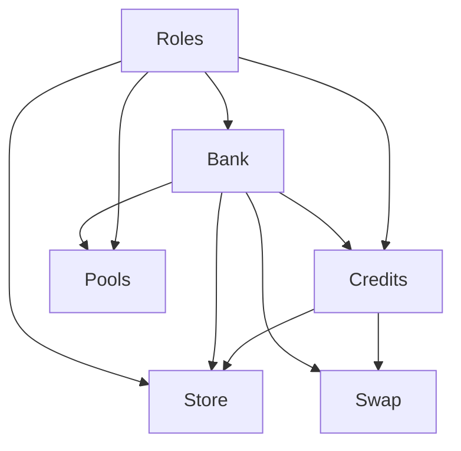

# Efforce marketplace blockchain

This is the repository of the web3 backend for the Efforce project. The repository is divided into six smart contracts:

- Bank
- Credits
- Pools
- Roles
- Store
- Swap

To install necessary packages, run `npm install`.

